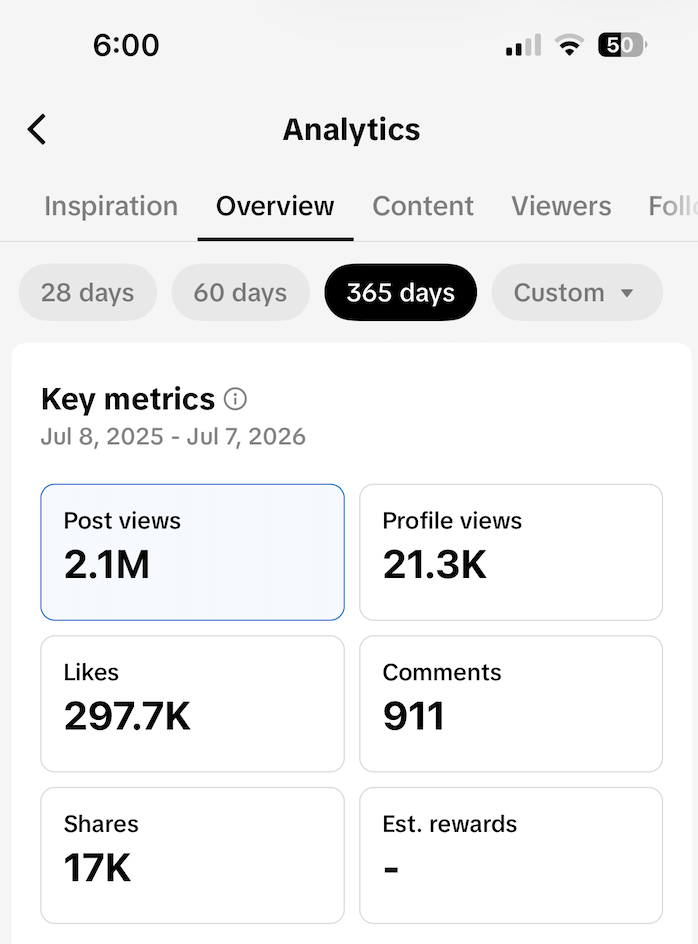

# cashflow-tracker

Summer 2025 I started reselling clothes. Initially on Facebook
Marketplace, then on Grailed, Depop, and eBay. Then I started to market my business on TikTok.

My videos did well and sales started to ramp up. I needed a better way to
track profits than on paper.



So I created this.

> **Demo:** [Watch the demo video](docs/cashflow-demo.mp4) or [here](https://fpettit-portfolio.vercel.app/projects/cashflow-tracker).

## How it's built

```
┌──────────────┐     /api      ┌───────────────────┐          ┌────────────┐
│  React SPA   │ ────────────► │  Spring Boot API  │ ───────► │ PostgreSQL │
│ (Vite + TS)  │               │     (Java 21)     │   JPA    │            │
└──────────────┘               └───────────────────┘          └────────────┘
                                        ▲
                                        │ REST
                               ┌────────┴────────┐
                               │ Python FastAPI  │──► Gmail API
                               │ automation svc  │──► Grailed (Playwright)
                               └─────────────────┘
```

- **Frontend** — React 19 + TypeScript, built with Vite and styled with
  Tailwind CSS. TanStack Query for data fetching, Recharts for the stats
  dashboards, react-globe.gl for the shipping globe. Component tests with
  Vitest + Testing Library.
- **Backend** — Spring Boot 3 (Java 21) REST API with controller/service/
  repository layering, JPA entities, and DTOs at the API boundary. Data lives
  in PostgreSQL, with SQL views powering the stats.
- **Automation** — Python + FastAPI service running scheduled jobs: Gmail
  ingestion with per-platform email parsers, and a Playwright bot managing
  the Grailed relist cycle with its own SQLite action log.

<details>
<summary>If you have a use case for this, here's how to set it up locally:</summary>

Requires Java 21, Node.js 20+, and PostgreSQL.

```bash
# database
createdb cashflow_tracker_db
psql cashflow_tracker_db -f app/database/create_tables.sql
psql cashflow_tracker_db -f app/database/create_views.sql

# backend — http://localhost:8080
./gradlew :app:bootRun

# frontend — http://localhost:5173
cd frontend && npm install && npm run dev
```

Datasource credentials are in `app/src/main/resources/application.properties`.
The automation service is optional — see [automation/README.md](automation/README.md).

</details>
